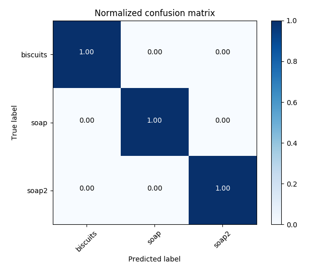
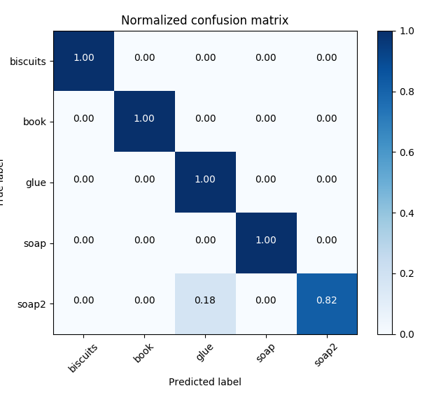
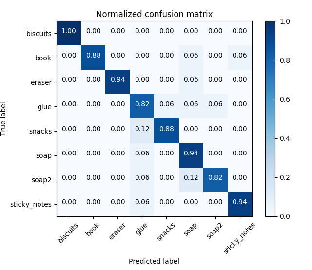

[](https://www.udacity.com/robotics)

# Project: 3D Perception with PR2 Robot

### Writeup by Muthanna A. Attyah
### Feb 2018
<p align="center">  </p>


## [Rubric](https://review.udacity.com/#!/rubrics/1067/view) Points


# The processing pipeline

## Convert ROS msg to PCL data

<p align="center">  </p>


## Statistical Outlier Filtering

<p align="center">  </p>

## Voxel Grid Downsampling

<p align="center">  </p>

## PassThrough Filter

<p align="center">  </p>

<p align="center">  </p>

## RANSAC Plane Segmentation

<p align="center">  </p>

<p align="center">  </p>

## Euclidean Clustering

<p align="center">  </p>

## Create Cluster-Mask Point Cloud to visualize each cluster separately

<p align="center">  </p>

## Converts a pcl PointXYZRGB to a ROS PointCloud2 message
```python
    ros_cloud_objects = pcl_to_ros(extracted_objects)
    ros_cloud_table   = pcl_to_ros(extracted_table)
    ros_cluster_cloud = pcl_to_ros(cluster_cloud)
```

## Publish ROS messages
```python
    pcl_objects_pub.publish(ros_cloud_objects)
    pcl_table_pub.publish(ros_cloud_table)
    pcl_cluster_pub.publish(ros_cluster_cloud)
```


## Test 1 - Training
| Test 1 | Values |
|-|-|
| Features in Training Set: | **51** |
| Invalid Features in Training set: | **0** |
| Scores: | **[1.  0.8 0.9 0.9 0.9]** |
| Accuracy: | **0.90 (+/- 0.13)** |
| accuracy score: | **0.9019607843137255** |


<p align="center">  </p>

<p align="center">  </p>

<p align="center">  </p>

## Test 2 - Training
| Test 2 | Values |
|-|-|
| Features in Training Set: | **85** |
| Invalid Features in Training set: | **0** |
| Scores: | **[0.82352941 0.82352941 0.82352941 0.64705882 0.94117647]** |
| Accuracy: | **0.81 (+/- 0.19)** |
| accuracy score: | **0.8117647058823529** |


<p align="center">  </p>

<p align="center">  </p>

<p align="center">  </p>

## Test 3 - Training
| Test 3 | Values |
|-|-|
| Features in Training Set: | **136** |
| Invalid Features in Training set: | **0** |
| Scores: | **[0.78571429 0.77777778 0.81481481 0.77777778 0.81481481]** |
| Accuracy: | **0.79 (+/- 0.03)** |
| accuracy score: | **0.7941176470588235** |


<p align="center">  </p>

<p align="center">  </p>


### Issues faced during project

* When compliling using `catkin_make` I used to get error "cannot convert to bool". I resolved it by adding `static_cast<bool>()`. [see this ](https://robotics.stackexchange.com/questions/14801/catkin-make-unable-to-build-and-throws-makefile138-recipe-for-target-all-fa)

### Future improvements


