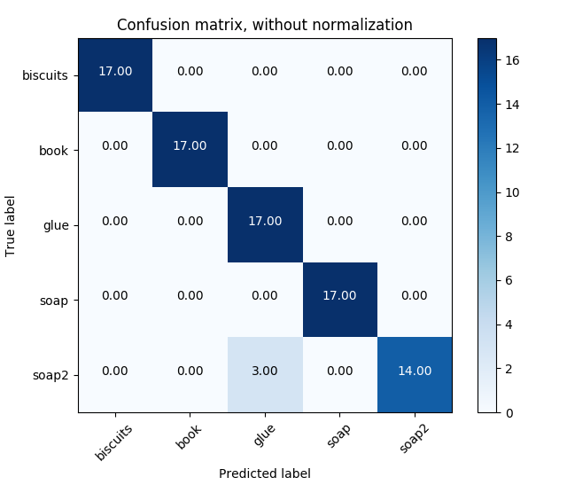
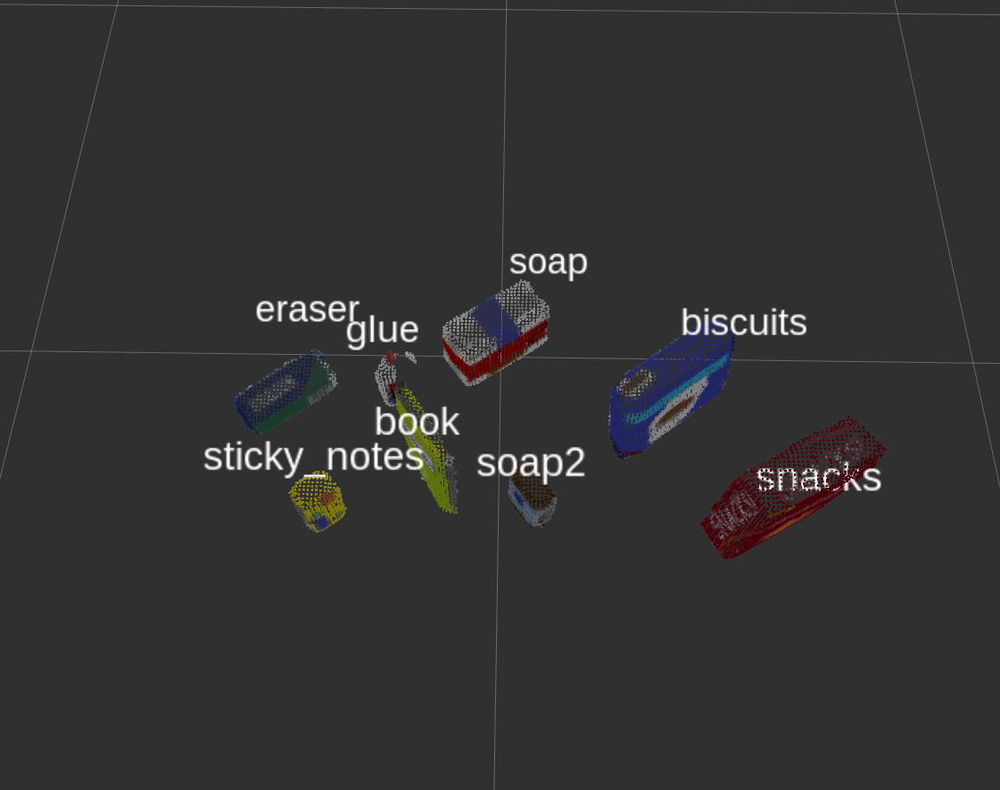

[](https://www.udacity.com/robotics)

# Project: 3D Perception with PR2 Robot

### Writeup by Muthanna A. Attyah
### Feb 2018
<p align="center">  </p>


## [Rubric](https://review.udacity.com/#!/rubrics/1067/view) Points


# The Perception Pipeline

Following sections will explain the different stages of the percption pipeline used to detect objects before starting the pick and place robot movement.


## Select topic and convert ROS msg to PCL data

The first step in the perception pipeline is to subscribe to the the camera data (point cloud) topic `/pr2/world/points` from which we will get a point cloud with noise as seen below:

<p align="center">  </p>

before we can process the data we need to convert it from **ROS PointCloud2** message to a **PCL PointXYZRGB** format using the following code:

```python
cloud_filtered = ros_to_pcl(ros_pcl_msg)
```

## Statistical Outlier Filtering

First filter is the  **PCL’s Statistical Outlier Removal** filter. in this filter for each point in the point cloud, it computes the distance to all of its neighbors, and then calculates a mean distance. By assuming a Gaussian distribution, all points whose mean distances are outside of an interval defined by the global distances mean+standard deviation are considered to be outliers and removed from the point cloud.

Code is as following:

```python
    # Create a statistical filter object: 
    outlier_filter = cloud_filtered.make_statistical_outlier_filter()
    # Set the number of neighboring points to analyze for any given point
    outlier_filter.set_mean_k(3)
    # Set threshold scale factor
    x = 0.00001
    # Any point with a mean distance larger than global (mean distance+x*std_dev)
    # will be considered outlier
    outlier_filter.set_std_dev_mul_thresh(x)
    # Call the filter function
    cloud_filtered = outlier_filter.filter()
```
Mean K = 3 was the best value I found to almost remove all noise pixels. any value higher than 3 was leaving some of the noise pixels behind. x was selcted to be 0.00001.

following image is showing result after removal of noise:

<p align="center">  </p>

## Voxel Grid Downsampling

2nd stage is **Voxel Grid Downsampling** filter to derive a point cloud that has fewer points but should still do a good job of representing the input point cloud as a whole. This is done to reduce required computation power without impacting the final results. Code is as following:

```python
    # Create a VoxelGrid filter object for our input point cloud
    vox = cloud_filtered.make_voxel_grid_filter()
    # Choose a voxel (also known as leaf) size
    # 1 means 1mx1mx1m leaf size   
    LEAF_SIZE = 0.005  
    # Set the voxel (or leaf) size  
    vox.set_leaf_size(LEAF_SIZE, LEAF_SIZE, LEAF_SIZE)
    # Call the filter function to obtain the resultant downsampled point cloud
    cloud_filtered = vox.filter()
```
After trying diffrent sizes I have selected leaf size 0.005 to avoid any impact on point cloud details.

result is as shown in below image:

<p align="center">  </p>

## PassThrough Filter

3rd stage is PassThrough filter which works much like a cropping tool allowing to crop any given 3D point cloud by specifying an axis with cut-off values along that axis. The region you allow to pass through, is often referred to as region of interest.

In our case I have applyed the filter two times, 1st one along **Z axis** to select only the table top and objects on it as shown in below code:

```python
    # Create a PassThrough filter object.
    passthrough = cloud_filtered.make_passthrough_filter()
    # Assign axis and range to the passthrough filter object.
    filter_axis = 'z'
    passthrough.set_filter_field_name(filter_axis)
    axis_min = 0.6095
    axis_max = 1.1
    passthrough.set_filter_limits(axis_min, axis_max)
    # Use the filter function to obtain the resultant point cloud. 
    cloud_filtered = passthrough.filter()
```
axis_min and axis_max was picked from RViz directly by reading the edge pixels values.

<p align="center">  </p>

2nd one is along **Y axis** to remove the unwanted left and right edges of the table. Code is as following:

```python
    # Create a PassThrough filter object.
    passthrough = cloud_filtered.make_passthrough_filter()
    # Assign axis and range to the passthrough filter object.
    filter_axis = 'y'
    passthrough.set_filter_field_name(filter_axis)
    axis_min = -0.456
    axis_max =  0.456
    passthrough.set_filter_limits(axis_min, axis_max)
    # Use the filter function to obtain the resultant point cloud. 
    cloud_filtered = passthrough.filter()
```
again axis_min and axis_max was selected from RViz by reading the values of the edge pixels.

<p align="center">  </p>


## RANSAC Plane Segmentation

Next we need to remove the table itself from the scene. To do this we will use a popular technique known as Random Sample Consensus or "RANSAC". RANSAC is an algorithm, that we can use to identify points in our dataset that belong to a particular model. In the case of the 3D scene we are working with here, the model we choose could be a plane, a cylinder, a box, or any other common shape. Since the top of the table in the scene is the single most prominent plane, after ground removal, we can effectively use RANSAC to identify points that belong to the table and discard/filter out those points.

code is as following:

```python
    # Create the segmentation object
    seg = cloud_filtered.make_segmenter()
    # Set the model you wish to fit 
    seg.set_model_type(pcl.SACMODEL_PLANE)
    seg.set_method_type(pcl.SAC_RANSAC)
    # Max distance for a point to be considered fitting the model
    # Experiment with different values for max_distance 
    # for segmenting the table
    max_distance = 0.006
    seg.set_distance_threshold(max_distance)
    # Call the segment function to obtain set of inlier indices and model coefficients
    inliers, coefficients = seg.segment()
    # Extract inliers (Table)
    extracted_table   = cloud_filtered.extract(inliers, negative=False)
    # Extract outliers (Tabletop Objects)
    extracted_objects = cloud_filtered.extract(inliers, negative=True)
```

Image of the objects:
<p align="center">  </p>

Image of the table:
<p align="center">  </p>

## Euclidean Clustering

<p align="center">  </p>

## Create Cluster-Mask Point Cloud to visualize each cluster separately

<p align="center">  </p>

## Converts a pcl PointXYZRGB to a ROS PointCloud2 message
```python
    ros_cloud_objects = pcl_to_ros(extracted_objects)
    ros_cloud_table   = pcl_to_ros(extracted_table)
    ros_cluster_cloud = pcl_to_ros(cluster_cloud)
```

## Publish ROS messages
```python
    pcl_objects_pub.publish(ros_cloud_objects)
    pcl_table_pub.publish(ros_cloud_table)
    pcl_cluster_pub.publish(ros_cluster_cloud)
```


## Test 1 - Training
| Test 1 | Values |
|-|-|
| Features in Training Set: | **51** |
| Invalid Features in Training set: | **0** |
| Scores: | **[1.  0.8 0.9 0.9 0.9]** |
| Accuracy: | **0.90 (+/- 0.13)** |
| accuracy score: | **0.9019607843137255** |


<p align="center">  </p>

<p align="center">  </p>

<p align="center">  </p>

## Test 2 - Training
| Test 2 | Values |
|-|-|
| Features in Training Set: | **85** |
| Invalid Features in Training set: | **0** |
| Scores: | **[0.82352941 0.82352941 0.82352941 0.64705882 0.94117647]** |
| Accuracy: | **0.81 (+/- 0.19)** |
| accuracy score: | **0.8117647058823529** |


<p align="center">  </p>

<p align="center">  </p>

<p align="center">  </p>

## Test 3 - Training
| Test 3 | Values |
|-|-|
| Features in Training Set: | **136** |
| Invalid Features in Training set: | **0** |
| Scores: | **[0.78571429 0.77777778 0.81481481 0.77777778 0.81481481]** |
| Accuracy: | **0.79 (+/- 0.03)** |
| accuracy score: | **0.7941176470588235** |


<p align="center">  </p>

<p align="center">  </p>

<p align="center">  </p>


## Results yaml files:


### Issues faced during project

* When compliling using `catkin_make` I used to get error "cannot convert to bool". I resolved it by adding `static_cast<bool>()`. [see this ](https://robotics.stackexchange.com/questions/14801/catkin-make-unable-to-build-and-throws-makefile138-recipe-for-target-all-fa)

### Future improvements


