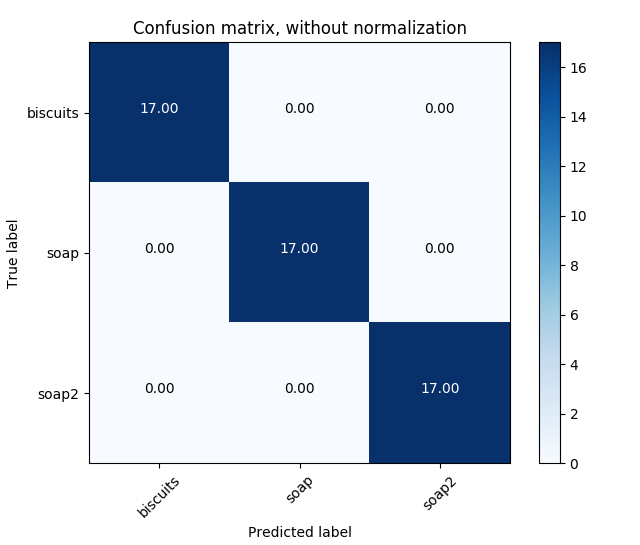

# Project: 3D Perception with PR2 Robot

### Writeup by Muthanna A. Attyah
### Feb 2018

  

## [Rubric](https://review.udacity.com/#!/rubrics/1067/view) Points

# The processing pipeline

## Convert ROS msg to PCL data

  

## Statistical Outlier Filtering

  

## Voxel Grid Downsampling

  

## PassThrough Filter

  

  

## RANSAC Plane Segmentation

  

## Extract inliers and outliers

  

  

## Euclidean Clustering

  

## Create Cluster-Mask Point Cloud to visualize each cluster separately

  

  

## Convert PCL data to ROS messages

## Publish ROS messages

## Test 1 - Training
| Test 1 | Values |
|-|-|
| Features in Training Set: | **51** |
| Invalid Features in Training set: | **0** |
| Scores: | **[1.  0.8 0.9 0.9 0.9]** |
| Accuracy: | **0.90 (+/- 0.13)** |
| accuracy score: | **0.9019607843137255** |

  

  

## Test 2 - Training
| Test 2 | Values |
|-|-|
| Features in Training Set: | **85** |
| Invalid Features in Training set: | **0** |
| Scores: | **[0.82352941 0.82352941 0.82352941 0.64705882 0.94117647]** |
| Accuracy: | **0.81 (+/- 0.19)** |
| accuracy score: | **0.8117647058823529** |

  

  

## Test 3 - Training
| Test 3 | Values |
|-|-|
| Features in Training Set: | **136** |
| Invalid Features in Training set: | **0** |
| Scores: | **[0.78571429 0.77777778 0.81481481 0.77777778 0.81481481]** |
| Accuracy: | **0.79 (+/- 0.03)** |
| accuracy score: | **0.7941176470588235** |

  

  

### Pick and Place Setup

#### 1. For all three tabletop setups (`test*.world`), perform object recognition, then read in respective pick list (`pick_list_*.yaml`). Next construct the messages that would comprise a valid `PickPlace` request output them to `.yaml` format.

Spend some time at the end to discuss your code, what techniques you used, what worked and why, where the implementation might fail and how you might improve it if you were going to pursue this project further.  

### Issues faced during project

* When compliling using `catkin_make` I used to get error "cannot convert to bool". I resolved it by adding `static_cast<bool>()`. [see this ](https://robotics.stackexchange.com/questions/14801/catkin-make-unable-to-build-and-throws-makefile138-recipe-for-target-all-fa)

### Future improvements

# Required Steps for a Passing Submission:
1. Extract features and train an SVM model on new objects (see `pick_list_*.yaml` in `/pr2_robot/config/` for the list of models you'll be trying to identify). 
2. Write a ROS node and subscribe to `/pr2/world/points` topic. This topic contains noisy point cloud data that you must work with.
3. Use filtering and RANSAC plane fitting to isolate the objects of interest from the rest of the scene.
4. Apply Euclidean clustering to create separate clusters for individual items.
5. Perform object recognition on these objects and assign them labels (markers in RViz).
6. Calculate the centroid (average in x, y and z) of the set of points belonging to that each object.
7. Create ROS messages containing the details of each object (name, pick_pose, etc.) and write these messages out to `.yaml` files, one for each of the 3 scenarios (`test1-3.world` in `/pr2_robot/worlds/`).  [See the example `output.yaml` for details on what the output should look like.](https://github.com/udacity/RoboND-Perception-Project/blob/master/pr2_robot/config/output.yaml)  
8. Submit a link to your GitHub repo for the project or the Python code for your perception pipeline and your output `.yaml` files (3 `.yaml` files, one for each test world).  You must have correctly identified 100% of objects from `pick_list_1.yaml` for `test1.world`, 80% of items from `pick_list_2.yaml` for `test2.world` and 75% of items from `pick_list_3.yaml` in `test3.world`.
9. Congratulations!  Your Done!

# Extra Challenges: Complete the Pick & Place
7. To create a collision map, publish a point cloud to the `/pr2/3d_map/points` topic and make sure you change the `point_cloud_topic` to `/pr2/3d_map/points` in `sensors.yaml` in the `/pr2_robot/config/` directory. This topic is read by Moveit!, which uses this point cloud input to generate a collision map, allowing the robot to plan its trajectory.  Keep in mind that later when you go to pick up an object, you must first remove it from this point cloud so it is removed from the collision map!
8. Rotate the robot to generate collision map of table sides. This can be accomplished by publishing joint angle value(in radians) to `/pr2/world_joint_controller/command`
9. Rotate the robot back to its original state.
10. Create a ROS Client for the “pick_place_routine” rosservice.  In the required steps above, you already created the messages you need to use this service. Checkout the [PickPlace.srv](https://github.com/udacity/RoboND-Perception-Project/tree/master/pr2_robot/srv) file to find out what arguments you must pass to this service.
11. If everything was done correctly, when you pass the appropriate messages to the `pick_place_routine` service, the selected arm will perform pick and place operation and display trajectory in the RViz window
12. Place all the objects from your pick list in their respective dropoff box and you have completed the challenge!
13. Looking for a bigger challenge?  Load up the `challenge.world` scenario and see if you can get your perception pipeline working there!
